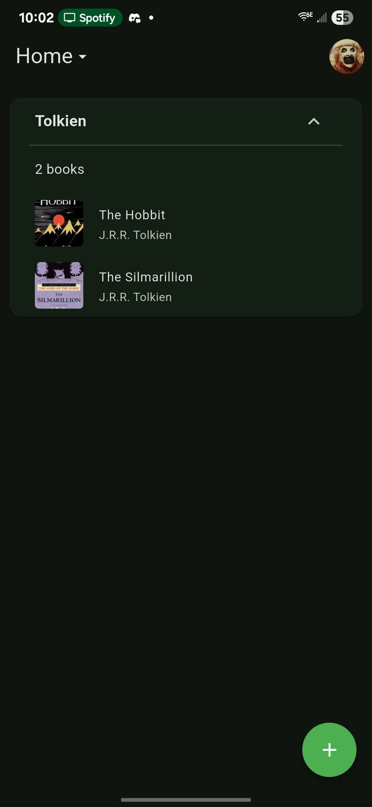
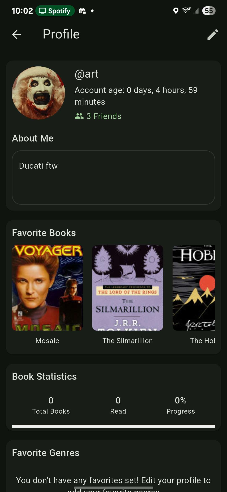

 myBookNook

**myBookNook** is a platform designed to help you organize your book collection. Whether you own books or have a wishlist of titles you want to acquire, myBookNook makes it easy to manage them. Using text recognition, you can scan ISBNs to quickly query and store book information.

⚠️ **Disclaimer**: This app is currently in testing. Features and functionality may change, and some aspects may not work as expected.

⚠️ **Note**: We are not accepting pull requests at this time.

## Features

- **Book Organization**: Categorize and manage books you own or want to own.
- **ISBN Scanning**: Use text recognition to scan ISBNs and fetch book details.
- **Wishlist**: Keep track of books you plan to acquire.
- **Progress Tracking**: Monitor your reading or collection goals with a built-in progress tracker.

## Screenshots

Explore myBookNook's interface with these screenshots:

<table>
  <tr>
    <td></td>
    <td></td>
    <td></td>
  </tr>
  <tr>
    <td></td>
    <td></td>
    <td></td>
  </tr>
</table>

## Installation

To install myBookNook on your Android device, follow these steps to manually install the APK from the releases page:

1. **Download the APK**:
   - Visit the [Releases](https://github.com/art-was-here/mybooknook/releases) page on the GitHub repository.
   - Download the latest `.apk` file.

2. **Enable Unknown Sources**:
   - On your Android device, go to **Settings > Security** (or **Settings > Apps & Notifications > Special app access** on newer versions).
   - Enable **Install unknown apps** or **Unknown sources** for your browser or file manager.

3. **Install the APK**:
   - Open your file manager or browser downloads folder.
   - Locate the downloaded `.apk` file and tap it.
   - Follow the on-screen prompts to install the app.

4. **Launch the App**:
   - Once installed, open myBookNook from your app drawer.

**Note**: Ensure you download the APK only from the official GitHub releases page to avoid security risks.

## Progress Tracker

- [x] Sign in with Google
  - [x] OAuth 2.0 Certification
  - [ ] Verification from Google
- [x] Firebase/Firestore Integrated
- [x] Add books to lists
  - [x] Add by name/isbn
  - [x] Add by text recognition to scan isbn
  - [x] Share books with other users
- [x] Friends list
  - [x] Add/Delete Friends
  - [x] Profiles per user
  - [x] Username's on sign up
- [x] Create custom lists
  - [x] Expand/Collapse lists
  - [x] Updated book details styling
  - [x] Delete from list
  - [x] Delete lists
- [ ] Card Views
  - [x] Go to author
  - [ ] Go to series
  - [x] Add links to Google Play Books, Amazon, AbeBooks with price
  - [x] Add share by link button
  - [x] Mark book as read (for statistics)
  - [x] Swipe down on card to dismiss
  - [x] Add user rating
- [ ] Settings
  - [ ] Theme Mode (switch to toggles again before marking this off)
  - [x] Accent Color selector
  - [x] Book List Order
  - [x] Total Books
  - [x] Books Read
  - [ ] Stats Page
    - [x] Reading Progress
    - [ ] Progress per list
    - [ ] Total Books, Total pages, Account Age
    - [ ] Awards for Account Age
    - [ ] Hide from profile
  - [x] Export Books
  - [x] Import Books
  - [ ] Download account information
  - [x] Delete Account

## Contributing

We appreciate your interest in contributing! However, as noted above, we are not accepting pull requests at this time. Stay tuned for updates on when contributions will be open.

## License

This project is licensed under the MIT License. See the [LICENSE](LICENSE) file for details.

